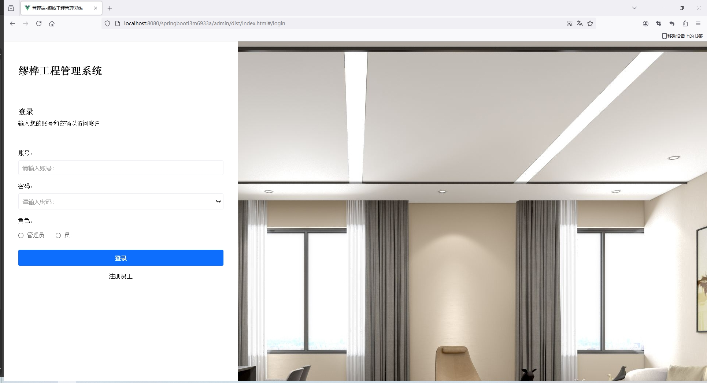
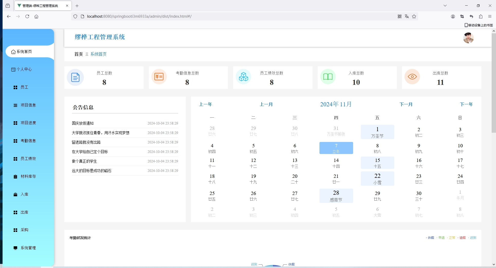
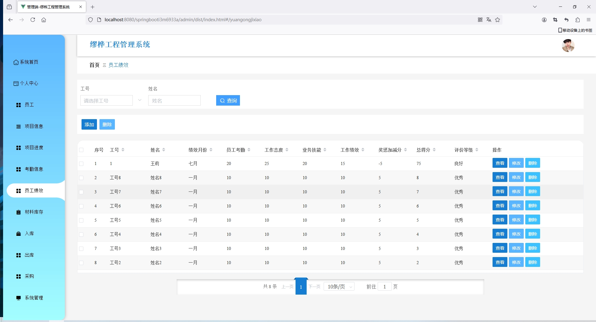
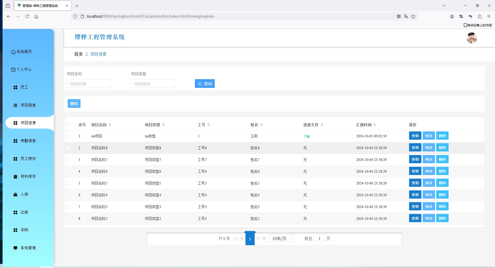
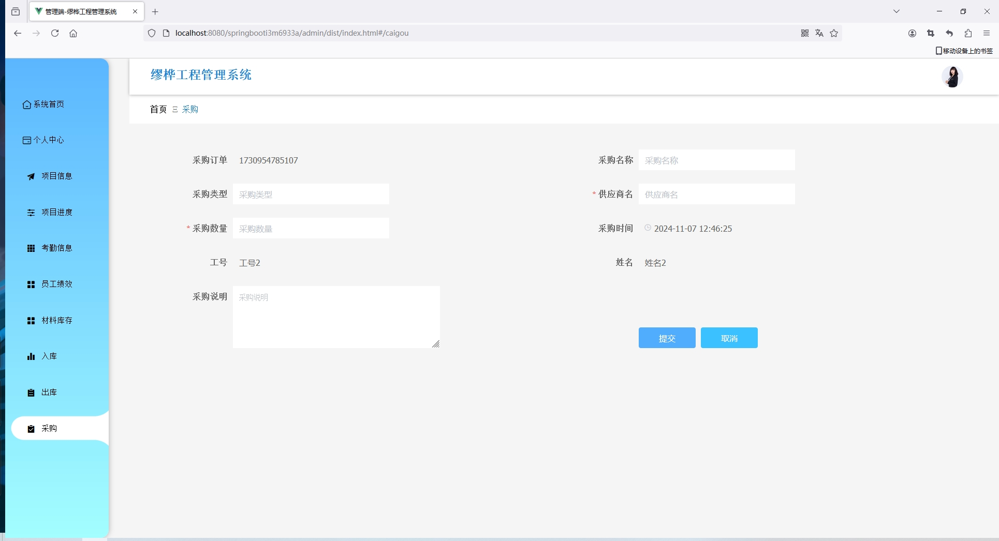
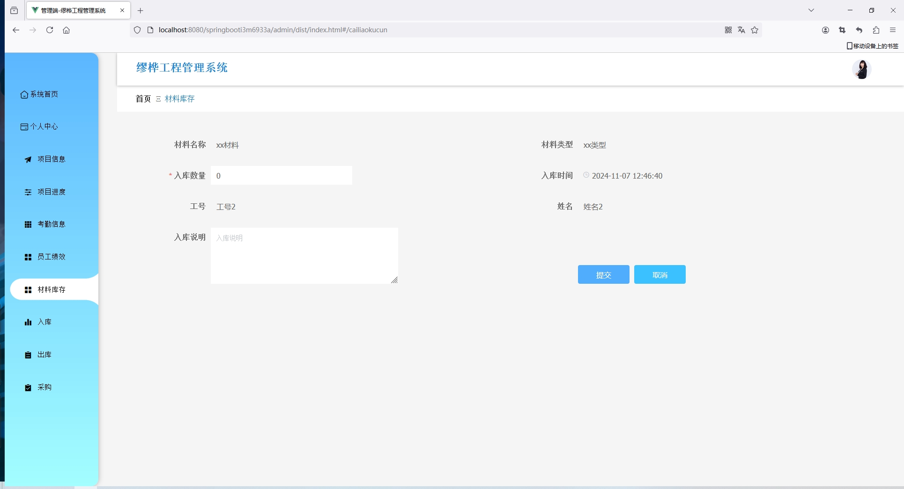
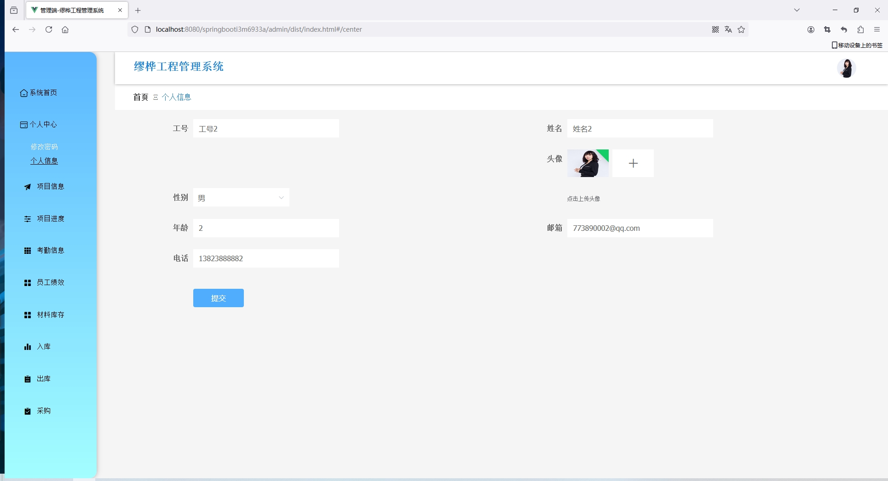

<h1 align="center">基于SSM实现的缪桦工程管理系统</h1>

- <b>完整代码获取地址：从戎源码网 ([https://armycodes.com/](https://armycodes.com/))</b>
- <b>技术探讨、资料分享，请加QQ群：692619798</b>
- <b>作者微信：19941326836  QQ：3645296857</b>
- <b>承接计算机毕业设计、Java毕业设计、Python毕业设计、深度学习、机器学习</b>
- <b>选题+开题报告+任务书+程序定制+安装调试+论文+答辩ppt 一条龙服务</b>
- <b>所有选题地址 ([https://github.com/Descartes007/allProject](https://github.com/Descartes007/allProject)) </b>

## 项目介绍

基于SSM实现的缪桦工程管理系统：前端 Vue、ElementUI、Axios，后端 SpringBoot、Mybatis，系统角色分为：管理员和员工，管理员在管理后台对用户信息、车辆信息管理等；用户可以车辆租赁等。主要功能如下：

## 功能
### 管理员

- 基本操作：登录、注册、修改密码、修改个人信息、文件下载
- 员工管理：获取员工列表、筛选员工信息、新增员工信息、查看员工信息详情、修改员工信息、删除员工信息
- 项目信息管理：获取项目信息列表、筛选项目信息、新增项目信息、查看项目信息详情、修改项目信息、删除项目信息
- 项目进度管理：获取项目进度列表、筛选项目进度、新增项目进度、查看项目进度详情、修改项目进度、删除项目进度、下载进度文件
- 考勤信息管理：获取考勤信息列表、筛选考勤信息、新增考勤信息、查看考勤信息详情、修改考勤信息、删除考勤信息
- 员工绩效管理：获取员工绩效列表、筛选员工绩效、新增员工绩效、查看员工绩效详情、修改员工绩效、删除员工绩效
- 材料库存管理：获取材料库存列表、筛选材料库存、新增材料库存、查看材料库存详情、修改材料库存、删除材料库存
- 入库管理：获取入库信息列表、筛选入库信息、查看入库信息详情、删除入库信息
- 出库管理：获取出库信息列表、筛选出库信息、查看出库信息详情、删除出库信息
- 采购管理：获取采购信息列表、筛选采购信息、审批采购信息、查看采购信息详情、删除采购信息
- 公告信息管理：获取公告信息列表、筛选公告信息、新增公告信息、查看公告信息详情、修改公告信息、删除公告信息
- 公告分类管理：获取公告分类列表、筛选公告分类、新增公告分类、查看公告分类详情、修改公告分类、删除公告分类

### 员工

- 基本操作：登录、注册、修改密码、修改个人信息、文件上传
- 项目信息管理：获取项目信息列表、筛选项目信息、查看项目信息详情、项目进度报告、上传文件
- 项目进度管理：获取项目进度列表、筛选项目进度、查看项目进度详情、修改项目进度、删除项目进度
- 考勤信息管理：获取考勤信息列表、筛选考勤信息、查看考勤信息详情
- 员工绩效管理：获取员工绩效列表、筛选员工绩效、查看员工绩效详情
- 材料库存管理：获取材料库存列表、筛选材料库存、查看材料库存详情、入库、出库
- 入库管理：获取入库信息列表、筛选入库信息、查看入库信息详情
- 出库管理：获取出库信息列表、筛选出库信息、查看出库信息详情
- 采购管理：获取采购信息列表、筛选采购信息、新增采购申请、查看采购信息详情、删除采购信息

## 环境

- <b>IntelliJ IDEA 2020.3</b>

- <b>Mysql 5.7.26</b>

- <b>NodeJs 14.17.3</b>

- <b>Maven 3.6.3</b>

- <b>JDK 1.8</b>

## 缩略图

